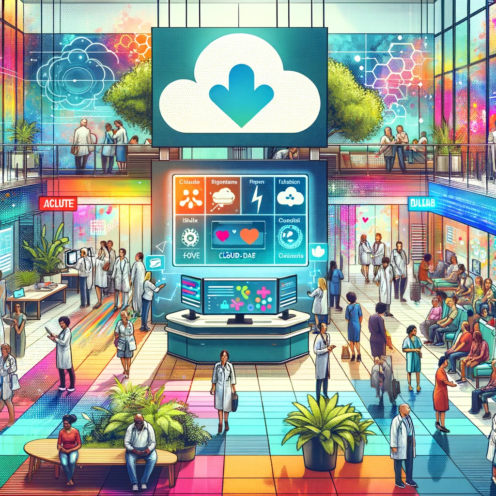
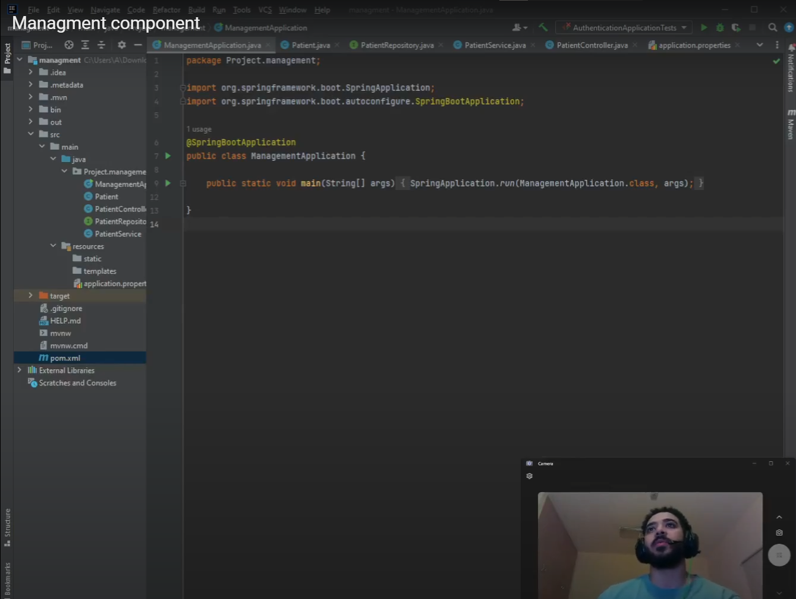
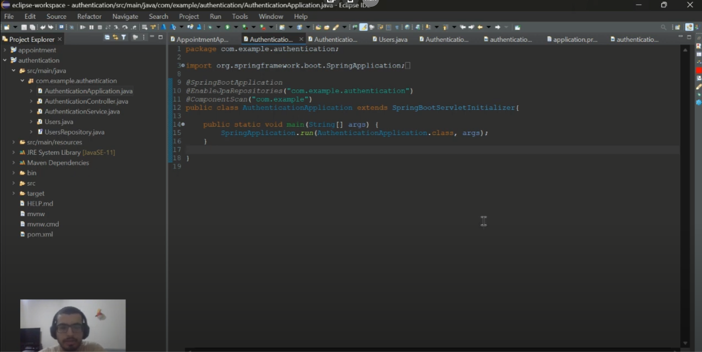
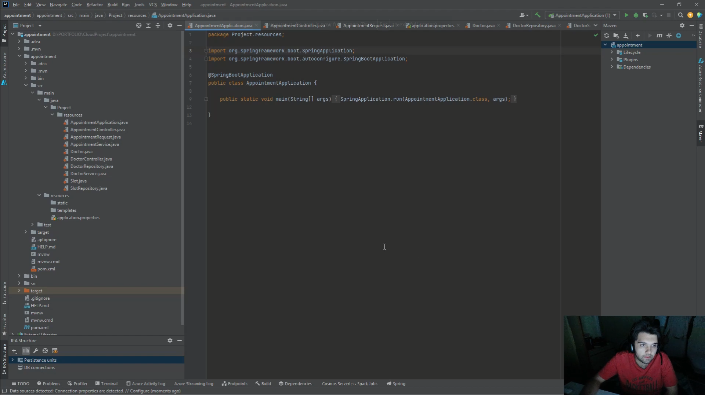
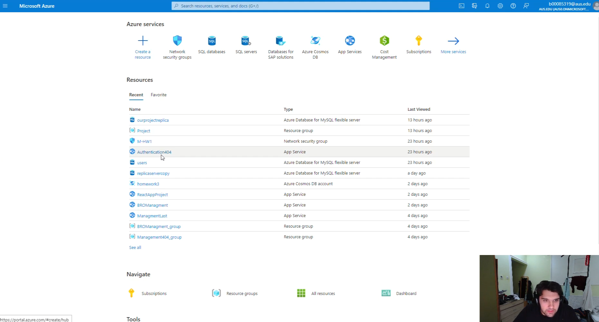

# Cloud-Based Healthcare Management System (CBHMS)

## Table of Contents
1. [Overview](#overview)
2. [System Architecture](#system-architecture)
3. [Conclusions & Future Extensions](#conclusions--future-extensions)
4. [Related Material](#related-material)

## Overview

The Cloud-Based Healthcare Management System (CBHMS), developed by Team Dream at the American University of Sharjah, College of Engineering, Computer Science and Engineering Department, is a comprehensive solution designed to streamline healthcare data management. This system centralizes various patient-related data and medical resources, integrating seamlessly with existing Hospital Information Systems (HIS).

### 1.1 Software Context
CBHMS evolves beyond traditional healthcare systems by offering a centralized approach to managing detailed patient demographics, medical histories, and diagnostic images. Through its well-crafted APIs, CBHMS integrates with a range of diagnostic tools and offers a real-time notification system.

### 1.2 Terminology & Definitions
- **CBHMS**: Cloud-Based Healthcare Management System.
- **Patient**: Individuals receiving medical care.
- **Doctor**: Medical professionals using the system.
- **Administrator**: Individuals overseeing CBHMS functionalities.

## System Architecture
### 2.1 Node Architecture
CBHMS features a robust architecture comprising Client Nodes, Diagnostic Tool Nodes, Server Node, and Database Node.

### 2.2 Component Architecture
The system is divided into various components for modularity and scalability:
- **User Interface (UI)**
- **User Authentication & Authorization Component (UAAC)**
- **Patient Records Management Component (PRMC)**
- **Medical Resource Management Component (MRMC)**
- **Analytics & Reporting Component (ARC)**

### 2.3 Data Architecture
CBHMS employs a detailed data structure for Users, Patients, Hospitals, and Doctors, ensuring efficient and secure data management.

## Conclusions & Future Extensions
CBHMS is designed to be scalable, secure, and user-friendly, addressing the needs of patients, healthcare providers, and administrators. Future enhancements could include AI-driven diagnostics, telemedicine, and more integrated patient engagement tools.

## Related Material
- [High-level Design Document](https://github.com/KhumamAlzagim/AzureCloudHospital/blob/main/High-level-Design.docx)
- Explination Videos:
##
Managment component

[View Video](https://www.youtube.com/watch?v=Vji9HhW9as0)

##

[View Video](https://www.youtube.com/watch?v=hS_-vjzjeTA)

##

[View Video](https://www.youtube.com/watch?v=qYTn44RuSyE)

##

[View Video](https://www.youtube.com/watch?v=BX9FJ0avyWM)

##
---

*This document is the property of Team Dream, American University of Sharjah. For further information or inquiries, please contact us at [b00085319@aus.edu](mailto:b00085319@aus.edu).*
